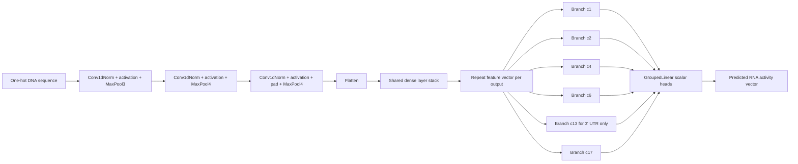

# Hani UTR BassetBranched Architecture and HPO Brief

This note summarizes the new 5' UTR and 3' UTR RNA activity sweeps configured in:

- `src/learn/configs/utr3/hani_rna_activity/basset_branched/`
- `src/learn/configs/utr5/hani_rna_activity/basset_branched/`

It is written as an illustration brief: use the diagrams, tables, and prompts below to generate architecture and HPO workflow figures.

## One Sentence Summary

We train a Basset-style one-hot DNA CNN with a shared convolutional trunk, a shared dense bottleneck, and one branched task-specific head per observed RNA activity output, then tune architecture and optimization hyperparameters with W&B Bayesian sweeps in a broad stage followed by a narrower focused stage.

## Datasets and Outputs

| Sweep family | DataModule | Input length | Sequence column | Activity outputs | Split | Normalization |
| --- | --- | ---: | --- | --- | --- | --- |
| 3' UTR | `UTR3_Branched_RNA_Activity_DataModule` | 240 bp | `seq` | `c1`, `c2`, `c4`, `c6`, `c13`, `c17` | preassigned `fold` column | z-score each output using train split statistics |
| 5' UTR | `UTR5_Branched_RNA_Activity_DataModule` | 50 bp | `seq` | `c1`, `c2`, `c4`, `c6`, `c17` | preassigned `fold` column | z-score each output using train split statistics |

The DataModule drops missing or non-numeric activity values, one-hot encodes DNA as shape `[batch, 4, length]`, uses the train/val/test labels in the `fold` column, and optionally augments only the training split with reverse complements. Reverse-complement augmentation was searchable in the broad sweeps and fixed to `False` in the focused sweeps.

## Model Architecture

Model module: `BassetBranched`  
Training wrapper: `CNNBasicTraining`  
Loss: `MSELoss` with `mean` reduction  
Prediction target: one scalar RNA activity value per observed output head

### Architecture Flow

```text
Input one-hot DNA
  3' UTR: [batch, 4, 240]
  5' UTR: [batch, 4, 50]
        |
        v
Conv block 1
  same-style constant padding
  Conv1dNorm: 4 -> conv1_channels, kernel conv1_kernel_size
  optional BatchNorm, no WeightNorm in these sweeps
  activation: ReLU, LeakyReLU, or ELU
  MaxPool1d(kernel=3)
        |
        v
Conv block 2
  same-style constant padding
  Conv1dNorm: conv1_channels -> conv2_channels, kernel conv2_kernel_size
  optional BatchNorm
  same activation
  MaxPool1d(kernel=4)
        |
        v
Conv block 3
  same-style constant padding
  Conv1dNorm: conv2_channels -> conv3_channels, kernel conv3_kernel_size
  optional BatchNorm
  same activation
  pad one base on each side
  MaxPool1d(kernel=4)
        |
        v
Flatten
  3' UTR flatten width: conv3_channels * 5
  5' UTR flatten width: conv3_channels * 1
        |
        v
Shared dense trunk
  n_linear_layers = 1 or 2
  each layer: LinearNorm -> activation -> Dropout(linear_dropout_p)
  width: linear_channels
        |
        v
Branched output module
  repeat shared feature vector once per output head
  n_branched_layers = 1 to 3 in broad sweeps, 2 to 3 in focused sweeps
  grouped branch-specific linear layers
  branch width: branched_channels
  branch activation: ReLU, LeakyReLU, or ELU
  branch dropout: branched_dropout_p
        |
        v
GroupedLinear final head
  one scalar per branch
  3' UTR output: [batch, 6]
  5' UTR output: [batch, 5]
```

### What To Emphasize In An Architecture Figure

- Show the first half as a shared sequence feature extractor: three convolution plus pooling blocks.
- Show the middle as a shared dense representation.
- Show the last half splitting into parallel branches, one branch per observed activity column.
- Label 3' UTR and 5' UTR as the same architecture template with different input length and number of output heads.
- Avoid drawing separate full CNNs for each cell/output. The CNN trunk is shared; only the late branch layers are task-specific.

## Broad Sweep Search Space

| Hyperparameter group | 3' UTR broad sweep | 5' UTR broad sweep |
| --- | --- | --- |
| W&B project | `utr3__hani_rna_activity__scratch__basset_branched` | `utr5__hani_rna_activity__scratch__basset_branched` |
| Objective | maximize `epoch_end_val_pearson_r2` | maximize `epoch_end_val_pearson_r2` |
| Training budget | max 240 epochs, min 30, patience 35 | max 220 epochs, min 25, patience 35 |
| Conv 1 channels | integer 120-300 | integer 64-200 |
| Conv 1 kernels | 7, 11, 15 | 5, 7, 11 |
| Conv 2 channels | integer 100-240 | integer 64-200 |
| Conv 2 kernels | 5, 7, 11 | 5, 7, 9 |
| Conv 3 channels | integer 100-240 | integer 64-200 |
| Conv 3 kernels | 5, 7, 11 | 3, 5, 7 |
| Shared dense layers | 1 or 2 | 1 or 2 |
| Shared dense width | integer 256-1000 | integer 64-512 |
| Shared activation | ReLU, LeakyReLU, ELU | ReLU, LeakyReLU, ELU |
| Shared dropout | uniform 0.10-0.45 | uniform 0.10-0.45 |
| Branch layers | 1, 2, or 3 | 1, 2, or 3 |
| Branch width | integer 64-256 | integer 32-160 |
| Branch activation | ReLU, LeakyReLU, ELU | ReLU, LeakyReLU, ELU |
| Branch dropout | uniform 0.05-0.45 | uniform 0.05-0.45 |
| Batch norm | True or False | True or False |
| Weight norm | False | False |
| Optimizer | Adam or AdamW | Adam or AdamW |
| Learning rate | log-uniform 1e-4 to 5e-3 | log-uniform 1e-4 to 5e-3 |
| Adam beta1 | uniform 0.85-0.95 | uniform 0.85-0.95 |
| Adam beta2 | uniform 0.98-0.999 | uniform 0.98-0.999 |
| AMSGrad | True or False | True or False |
| Weight decay | log-uniform 1e-5 to 1e-2 | log-uniform 1e-5 to 1e-2 |
| Scheduler | CosineAnnealingWarmRestarts or None | CosineAnnealingWarmRestarts or None |
| Scheduler T_0 | 1000, 2000, or 4000 steps | 1000, 2000, or 4000 steps |
| Batch size | 256 or 512 | 256 or 512 |
| Reverse complements | True or False | True or False |

## Focused Sweep Search Space

The focused sweeps narrow the search around better-performing broad-sweep regions and make two process choices: reverse complements are fixed off, and branch depth is restricted to 2 or 3 layers.

| Hyperparameter group | 3' UTR focused sweep | 5' UTR focused sweep |
| --- | --- | --- |
| W&B project | `utr3__hani_rna_activity__focused__basset_branched` | `utr5__hani_rna_activity__focused__basset_branched` |
| Objective | maximize `epoch_end_val_pearson_r2` | maximize `epoch_end_val_pearson_r2` |
| Training budget | max 260 epochs, min 30, patience 40 | max 240 epochs, min 25, patience 40 |
| Conv 1 channels | integer 140-300 | integer 72-200 |
| Conv 1 kernels | 7, 11, 15 | 5, 7, 11 |
| Conv 2 channels | integer 100-240 | integer 96-200 |
| Conv 2 kernels | 5, 7, 11 | 5, 7, 9 |
| Conv 3 channels | integer 100-220 | integer 72-180 |
| Conv 3 kernels | 5, 7, 11 | 3, 5, 7 |
| Shared dense layers | 1 or 2 | 1 or 2 |
| Shared dense width | integer 320-800 | integer 200-550 |
| Shared activation | ReLU, LeakyReLU, ELU | ReLU, LeakyReLU, ELU |
| Shared dropout | uniform 0.10-0.42 | uniform 0.10-0.45 |
| Branch layers | 2 or 3 | 2 or 3 |
| Branch width | integer 64-256 | integer 40-160 |
| Branch activation | ReLU, LeakyReLU, ELU | ReLU, LeakyReLU, ELU |
| Branch dropout | uniform 0.10-0.40 | uniform 0.08-0.45 |
| Batch norm | True or False | fixed False |
| Weight norm | False | False |
| Optimizer | Adam or AdamW | Adam or AdamW |
| Learning rate | log-uniform 2e-4 to 3.5e-3 | log-uniform 5e-5 to 1.5e-3 |
| Adam beta1 | uniform 0.86-0.95 | uniform 0.86-0.95 |
| Adam beta2 | uniform 0.985-0.999 | uniform 0.985-0.999 |
| AMSGrad | True or False | True or False |
| Weight decay | log-uniform 1e-5 to 5e-3 | log-uniform 1e-5 to 3e-3 |
| Scheduler | CosineAnnealingWarmRestarts or None | CosineAnnealingWarmRestarts or None |
| Scheduler T_0 | 1000, 2000, or 4000 steps | 1000, 2000, or 4000 steps |
| Batch size | 256 or 512 | 256 or 512 |
| Reverse complements | fixed False | fixed False |

## HPO Process

```text
1. Prepare observed-head Hani UTR tables
   - 3' UTR: 240 bp inputs, six observed activity heads.
   - 5' UTR: 50 bp inputs, five observed activity heads.

2. Launch broad Bayesian sweeps
   - Search architecture capacity, convolution kernels, dense width/depth,
     branch width/depth, dropout, batch norm, optimizer, learning rate,
     weight decay, scheduler, batch size, and reverse complements.
   - Default launcher behavior: one W&B sweep per UTR family, NUM_AGENTS set
     from available idle GPUs, NUM_RUNS defaulting to 8 runs per agent.

3. Evaluate runs by validation Pearson R^2
   - `CNNBasicTraining` logs `epoch_end_val_pearson_r2` at the end of each
     validation epoch.
   - Checkpointing and early stopping both monitor this metric in max mode.
   - Per-output Pearson, Pearson^2, Spearman, and MSE are also logged.

4. Define focused Bayesian sweeps
   - Narrow the broad architecture and optimizer ranges.
   - Remove reverse-complement augmentation.
   - Favor deeper branch heads by requiring 2 or 3 branch layers.
   - For 5' UTR, fix batch norm to False.
   - Default launcher behavior: NUM_RUNS defaults to 16 runs per agent.

5. Train, test, and archive each run
   - Run `train_wandb_log.py` under W&B agent control.
   - Train on GPU with 16-bit precision.
   - After fitting, load the best checkpoint and run test-set evaluation.
   - Save `torch_checkpoint.pt`, `provenance.json`, and a tarball in
     `src/learn/local_artifacts/...`.
   - Append run metadata and metrics to `src/learn/run_registry/runs.csv`.
```

## HPO Workflow Diagram


## Architecture Diagram



## Illustration Prompt: Model Architecture

Create a clean scientific model architecture diagram for a genomic sequence regression model named "BassetBranched for Hani UTR RNA Activity".

Show a left-to-right neural network pipeline. The input is one-hot DNA with shape `[batch, 4, L]`, where L is 240 bp for 3' UTR and 50 bp for 5' UTR. The shared trunk has three 1D convolution blocks: Conv1dNorm plus activation plus max pooling by 3, then Conv1dNorm plus activation plus max pooling by 4, then Conv1dNorm plus activation plus max pooling by 4 after one-base padding. Label this as a shared Basset-style CNN feature extractor.

After the convolution trunk, show flattening into a shared dense trunk with one or two LinearNorm layers, activation, and dropout. Then show the representation splitting into branch-specific grouped linear heads. The branch heads are late-task-specific heads: one branch per observed RNA activity output. For 3' UTR, label the six outputs c1, c2, c4, c6, c13, and c17. For 5' UTR, label the five outputs c1, c2, c4, c6, and c17.

Emphasize that the CNN and dense trunk are shared across all outputs, while only the final branch layers are output-specific. Use a polished publication-style aesthetic, with clear arrows, compact labels, and two small side badges: "3' UTR: L=240, 6 heads" and "5' UTR: L=50, 5 heads".

## Illustration Prompt: HPO Process

Create a concise workflow figure titled "Bayesian HPO for Hani 5' and 3' UTR BassetBranched Models".

Show five stages in a loop or pipeline:

1. Observed-head UTR tables: input columns are `seq`, `fold`, and activity columns.
2. Data preprocessing: drop missing values, split by preassigned train/val/test fold, z-score each activity using train split statistics, one-hot encode DNA.
3. Broad W&B Bayesian sweep: search convolution widths/kernels, dense depth/width/dropout, branch depth/width/dropout, activation, batch norm, optimizer, learning rate, weight decay, scheduler, batch size, and reverse complements.
4. Focused W&B Bayesian sweep: narrow ranges, fix reverse complements off, require 2 or 3 branch layers, and for 5' UTR fix batch norm off.
5. Model selection and archiving: maximize `epoch_end_val_pearson_r2`, early stop and checkpoint on that metric, evaluate test set, save checkpoint/provenance/artifact tarball, and write to the run registry.

Use two parallel swimlanes for 3' UTR and 5' UTR where useful. The 3' UTR lane should show 240 bp input and six outputs; the 5' UTR lane should show 50 bp input and five outputs. Keep the figure technical, minimal, and suitable for a manuscript methods overview.

## Caption Draft

The BassetBranched model uses a shared one-dimensional convolutional sequence encoder followed by a shared dense representation and late branch-specific grouped linear heads. For the Hani observed-head RNA activity task, 3' UTR sequences are modeled as 240 bp inputs with six activity outputs, while 5' UTR sequences are modeled as 50 bp inputs with five activity outputs. Hyperparameters were optimized with W&B Bayesian sweeps in two stages: a broad search over architecture, optimizer, scheduler, batch size, normalization, and reverse-complement augmentation, followed by a focused search that narrowed high-performing ranges, disabled reverse-complement augmentation, and emphasized deeper branch heads. Runs were selected by validation Pearson R^2, checkpointed with early stopping on the same metric, evaluated on the held-out test split, and archived with provenance in the local run registry.

