# Lib1 Dedup Phase 1 Workflow Relationships

**Generated:** 2026-07-16

**Purpose:** diagram-ready handoff describing the redesigned five-part Lib1
single-CRE workflow after exact barcode deduplication, how each completed
development stage informed the next one, where the one-time audit belongs,
and why Stage 4 downsampling remains a later study rather than a prerequisite
for reporting the selected single-part baselines.

**Status after the July 16 locked audit:** Stage 1, Stage 2, the bounded
targeted 3'UTR HPO, Stage 3 development analysis, 15 fixed-budget final
refits, and the one-time five-part audit are complete. The audit was opened
only after the five policies and 15-checkpoint allowlist were frozen. Stage 4
is planned but not launched.

This is an explanatory relationship map, not a replacement for the dated
protocol amendments. If a number or rule conflicts with a binding amendment,
the newer amendment controls.

## One-Line Workflow

```text
canonical exact-dedup mean target + frozen audit/development split
  -> exact replay of already-observed configurations
  -> five-fold paired RC screen + bounded route challengers
  -> bounded targeted 3'UTR UTRBassetVL optimizer search
  -> ten-config-per-part paired weighted-loss study
  -> admissibility gates + part-specific one-SE selection
  -> all-development fixed-budget refits + one-time frozen audit [complete]
  -> development-only downsampling learning curves [later]
```

The audit and Stage 4 are not a feedback loop. The audit estimates final
generalization for the already-selected policies. Stage 4 later asks how much
development training data those policies need. Audit results must not select
a different HPO arm, loss, RC policy, epoch budget, or Stage 4 configuration.

## Diagram Sketch

```mermaid
flowchart LR
    A["Data and evaluation redesign<br/>exact-dedup log2 RNA/DNA mean target<br/>frozen audit + five disjoint development folds"]
    B["Stage 1: exact-config replay<br/>885 dedup rows<br/>+ 25 matched pre-dedup diagnostic mates"]
    C["Stage 2: paired RC screen<br/>500 core + 160 bounded challenger cells<br/>660 development cells total"]
    D["Targeted 3'UTR branch<br/>24 UTRBassetVL configs<br/>x 5 folds x RC off/on = 240"]
    E["Stage 3: paired loss study<br/>10 configs per part<br/>450 weighted + 450 reused unweighted"]
    F["Admissibility + one-SE selection<br/>one policy per CRE part<br/>development OOF only"]
    G["Completed locked audit<br/>15 all-development refits<br/>hashed checkpoint allowlist<br/>one-time scoring"]
    H["Later Stage 4: downsampling<br/>nested development training sizes<br/>sample-efficiency learning curves"]
    I["Intron sensitivity lane<br/>natural mixture + within-inferred-stratum views<br/>same rows and predictions"]

    A --> B
    B -->|"promote 10 configs per part"| C
    C -->|"UTRBassetVL headroom but high variance"| D
    C -->|"other-part candidates and paired RC evidence"| E
    D -->|"7 UTRBassetVL + 3 ResNet1D Stage 3 portfolio;<br/>RC fixed off for 3'UTR"| E
    E --> F
    F --> G
    F -.->|"freeze shortlist from development evidence"| H
    G -.->|"chronologically later is allowed;<br/>audit cannot redesign Stage 4"| H
    A -.-> I
    C -.-> I
    E -.-> I
    G -.-> I
```



## Recommended Figure Layout

For a presentation graphic in the style of the June workflow figure, use a
wide landscape canvas with these visual regions:

1. A blue band across the top for shared evaluation constants: exact-dedup
   target, five development folds, model seed 1701 during development,
   high-barcode heldout rows, and a locked audit icon.
2. A left-to-right main chain of five boxes: data redesign, Stage 1 exact
   replay, Stage 2 paired RC, Stage 3 paired loss, and one-SE selection.
3. Put the bounded targeted 3'UTR HPO in a purple branch above the arrow from
   Stage 2 to Stage 3. Its arrow rejoins Stage 3 because it supplies the 3'UTR
   portfolio; it does not replace the cross-part Stage 2 screen.
4. Put the Intron inferred-strata analysis in a teal lane below Stages 2 and
   3. Use dashed connectors because it is a sensitivity estimand on the same
   OOF rows, not a separate training campaign or replacement validation set.
5. Put the completed one-time audit in a red-outlined locked box immediately
   after selection. Draw a thick vertical boundary before it labeled
   `development-only / audit opened once`; show that no arrow returns left.
6. Put Stage 4 downsampling in an amber box to the far right or lower right,
   labeled `later; development-only`. Connect the selected development
   policies to it with a dashed design arrow. Do not draw an arrow from audit
   performance back to HPO or Stage 4 selection.

Suggested legend:

```text
solid arrow  = configuration/policy promotion
dashed arrow = diagnostic evidence or predeclared later study
blue         = shared data/evaluation contract
green        = completed model-development stage
purple       = bounded targeted 3'UTR branch
teal         = Intron sensitivity reporting
red outline  = one-time frozen audit boundary
amber        = later operational learning curves
```

## Shared Evaluation Redesign

The canonical task is now construct-variant mean expression, not the spread
of barcode-level expression:

```text
target = log2(RNA_bc_counts_sum / DNA_bc_counts_sum)
data generation = dedup_exact_v1
training eligibility = n_barcodes >= 1
development/audit eligibility = n_barcodes >= 8
training-fold normalization = enabled
```

The split redesign separates two roles that were blurred in the earlier
workflow:

- five disjoint high-barcode development folds provide out-of-fold (OOF)
  predictions for hyperparameter, RC, and loss selection;
- one frozen high-barcode audit set per part remains completely outside model
  development and is scored only after the policy and refit procedure are
  frozen.

| Part | Exact-dedup rows | Development-HQ rows | Frozen audit rows |
|---|---:|---:|---:|
| Enhancer | 4,787 | 979 | 250 |
| Promoter | 7,893 | 1,545 | 386 |
| Intron | 7,848 | 1,061 | 265 |
| 3'UTR | 6,845 | 525 | 250 |
| 5'UTR | 8,331 | 1,438 | 359 |

Pooled OOF Pearson is calculated after concatenating the five disjoint fold
prediction products, so every development-HQ construct contributes exactly
one prediction. The five fold-specific Pearson values are retained to show
split stability; they are not treated as five independent biological
replicates.

## Baseline/Data-Product Comparison

Exact barcode deduplication changes the construct-level target values and
therefore makes the pre-dedup selection chain non-canonical. It does not imply
that every earlier architectural observation was useless. The redesign uses
the historical runs as a source of already-observed configurations, then
re-evaluates those configurations on the canonical dedup target and split
contract.

Stage 1 contained:

```text
885 fixed-manifest exact-dedup replay rows
+ 25 separately labeled pre-dedup diagnostic mates
```

The 25 paired pre-dedup mates isolate the data-product contrast under matched
config, fold, model seed, RC-off, and unweighted loss. They are supporting
diagnostics only and never enter dedup model selection. Stage 1 was a replay,
not a fresh Bayesian HPO: it did not invent unseen hyperparameter
combinations.

Stage 1 promoted ten already-trained base configurations per part using only
development evidence, with bounded diversity/secondary-metric slots. A
`base_config_id` describes model and training hyperparameters while excluding
fold, seed, RC, loss, data generation, and logging paths so those excluded
fields can be tested as paired experimental factors.

## Stage 2: Five-Fold Paired RC Screen

Stage 2 asks whether deterministic reverse-complement duplication of training
sequences helps the same model on original-orientation heldout sequences.
Validation is never reverse-complement averaged.

Core design:

```text
5 parts x 10 configs x 5 development folds x 2 RC modes = 500 cells
```

Two bounded route challengers were added before launch:

```text
Enhancer transfer: 2 source heads x 3 transfer scopes x 5 folds x 2 RC = 60
3'UTR UTRBassetVL: 10 configs x 5 folds x 2 RC = 100
```

The complete Stage 2 product contains 660 cells: 50 exact fold-0/RC-off Stage
1 cells were reused and 610 cells were newly launched. It resolves 132
complete OOF arms and 66 exact RC pairs.

Main result-driven transitions:

- Enhancer transfer clearly outperformed the scratch lane and supplied the
  leading Enhancer candidates. RC on was supported for several transfer
  policies.
- Promoter and 5'UTR favored RC off.
- Intron RC benefit was config-specific rather than a blanket part-wide
  result.
- 3'UTR UTRBassetVL showed substantially more headroom than ResNet1D, but
  also high fold/config variability. This motivated one bounded targeted HPO
  rather than immediate final selection.

## Bounded Targeted 3'UTR HPO

The targeted branch held the UTRBassetVL architecture, split, target, seed,
loss, scheduler, and epoch contract fixed. It searched only:

| Dimension | Fixed grid |
|---|---|
| AdamW learning rate | 0.001, 0.002, 0.004, 0.006 |
| AdamW weight decay | 0.0001, 0.0007, 0.003 |
| Shared dropout | 0.35, 0.50 |

All `4 x 3 x 2 = 24` configurations received five folds and both RC modes,
for 240 new cells and 48 complete OOF arms. There was no noisy partial-fold
screening step.

The search found a local optimizer neighborhood around learning rate 0.002,
not evidence for continuing to raise the learning-rate boundary. RC-on caused
many collapsed/constant-prediction cells at higher learning rates and no
targeted configuration passed the RC gate. Therefore, the newer Stage 3
amendment fixed 3'UTR RC off while retaining weighted-versus-unweighted loss.

The Stage 3 3'UTR portfolio was frozen as seven UTRBassetVL configurations
plus three ResNet1D controls. Portfolio membership made every member eligible
for selection; it did not force architecture diversity into the final model.

## Stage 3: Paired Weighted-Loss Study

Stage 3 is not another open-ended HPO. Each CRE part has a predeclared
ten-config portfolio. The only newly trained factor is barcode-weighted versus
the exact immutable unweighted mate:

```text
w_i = clip(log1p(n_barcodes_i) / log1p(8), 0.1, 1.0)
weighted MSE = sum(w_i * row_MSE_i) / sum(w_i)
```

Training is weighted; validation rows and all OOF metrics remain unweighted.

| Part | Configs | RC modes | New weighted | Reused unweighted | Analysis cells |
|---|---:|---|---:|---:|---:|
| Enhancer | 10 | off, on | 100 | 100 | 200 |
| Promoter | 10 | off, on | 100 | 100 | 200 |
| Intron | 10 | off, on | 100 | 100 | 200 |
| 3'UTR | 10 | off only | 50 | 50 | 100 |
| 5'UTR | 10 | off, on | 100 | 100 | 200 |
| **Total** | **50** |  | **450** | **450** | **900** |

An **arm** is one `(part, base config, RC policy, loss policy)` condition
pooled across five folds. A **cell** is one fold-trained run inside that arm.
Stage 3 resolves 180 complete OOF arms.

## From Paired Gates To One Selected Policy

The selection process deliberately separates two questions.

### 1. Is an intervention admissible?

RC on or weighted loss must earn entry by beating its exact conservative mate
on paired folds. The common Pearson requirements are:

```text
mean of five paired fold-Pearson deltas >= +0.005
positive Pearson delta in at least 4 of 5 folds
```

It must also remain inside predeclared part-specific RMSE and COD R2
degradation allowances. For Intron, the paired change must additionally be
non-negative on average after removing inferred-stratum mean offsets, with no
more than two negative folds. RC-off/unweighted is the default admissible
baseline; RC-on/weighted must pass both intervention gates.

This means `gate_pass` is not a claim that an arm's absolute Pearson is high.
It means the intervention itself showed a sufficiently consistent paired gain
without unacceptable calibration/error degradation.

### 2. Which admissible arm is preferred?

For each part independently:

1. identify the admissible arm with the highest pooled raw OOF Pearson;
2. estimate that best arm's Pearson SE with 10,000 fold-stratified row
   bootstraps;
3. include every admissible arm with
   `Pearson >= best Pearson - SE(best)` in the one-SE band;
4. within the band, prefer the highest minimum-fold Pearson;
5. for Intron, next prefer minimum-stratum and within-stratum-centered
   Pearson, then use RMSE, COD R2, and deterministic tie rules.

The one-SE band is an uncertainty-aware candidate set, not a statistical
equivalence test. It permits a slightly lower pooled point estimate when that
arm has better worst-fold stability. In the final results, 3'UTR is the only
part for which this stability rule selected an arm below the highest pooled
OOF Pearson point estimate.

## Frozen Development-Selected Policies

| Part | Architecture / route | RC | Loss | Pooled OOF Pearson | Minimum fold |
|---|---|---|---|---:|---:|
| Enhancer | BassetBranched, K562 full transfer | on | unweighted | 0.564722 | 0.508781 |
| Promoter | PromoterBassetVL scratch | off | weighted | 0.478157 | 0.394573 |
| Intron | ResNet1D scratch | off | weighted | 0.690313 | 0.648779 |
| 3'UTR | UTRBassetVL scratch | off | weighted | 0.492697 | 0.391328 |
| 5'UTR | UTRBassetVL scratch | off | weighted | 0.542062 | 0.525582 |

Accepted intervention effects for the selected policies were:

- Enhancer: RC-on minus RC-off pooled Pearson `+0.029375`; unweighted kept;
- Promoter: weighted minus unweighted `+0.009229`;
- Intron: weighted minus unweighted `+0.016010`;
- 3'UTR: weighted minus unweighted `+0.010479`; RC was fixed off;
- 5'UTR: weighted minus unweighted `+0.022674`.

The 3'UTR numerical leader had pooled Pearson 0.547563, but the one-SE band
was wide. The frozen stability ordering selected the 0.492697 arm because its
minimum-fold Pearson was 0.391328 versus 0.371979 for the numerical leader.
This is an explicit pooled-performance versus worst-fold-stability tradeoff,
not a plotting or ranking error.

## Completed One-Time Audit

After selection, each policy was refit on every eligible non-audit row at its
development-frozen epoch budget for seeds 1701, 1702, and 1703. A hashed
15-checkpoint allowlist was frozen before the audit loader was instantiated.
The primary predictor is the construct-wise arithmetic mean of the three raw
seed predictions. The seed range below is an initialization-sensitivity view,
not an SE or confidence interval.

| Part | Development OOF Pearson | Audit ensemble Pearson | Audit seed Pearson range | Audit RMSE | Audit COD R2 | Raw calibration slope | Audit n |
|---|---:|---:|---:|---:|---:|---:|---:|
| Enhancer | 0.564722 | 0.365249 | 0.344356–0.375474 | 0.845041 | 0.003804 | 0.503702 | 250 |
| Promoter | 0.478157 | 0.443849 | 0.431757–0.442632 | 0.418492 | 0.189269 | 1.247062 | 386 |
| Intron | 0.690313 | 0.681348 | 0.665337–0.678601 | 0.516901 | 0.461761 | 0.949539 | 265 |
| 3'UTR | 0.492697 | 0.452441 | 0.368282–0.406574 | 0.582604 | 0.189828 | 1.142402 | 250 |
| 5'UTR | 0.542062 | 0.512086 | 0.498482–0.504572 | 0.398897 | 0.256697 | 0.926637 | 359 |

Development OOF and audit are shown beside one another descriptively, not as
a paired significance test: OOF combines five fold-specific models, whereas
audit uses three full-development refits and an ensemble. Four parts retain
roughly similar association on the independent audit. Enhancer is the clear
caution: audit Pearson is 0.365, COD R2 is approximately zero, and its
observed-on-prediction slope is 0.50. That supports a weaker Enhancer
generalization/calibration claim; it does not authorize switching to another
arm after audit visibility. Promoter and 3'UTR show moderate slope departures,
while Intron and 5'UTR are closer to unit raw-scale slope.

No affine correction was fit or applied on audit. The calibration slopes are
diagnostics only. Seed 1701 remains the predeclared canonical neural
checkpoint for later single-checkpoint integration; the three-seed raw mean
remains the primary reported audit predictor.

## Intron Sensitivity Lane

The three current Intron categories are deterministic nested sequence masks:

```text
mask1_specific
mask2_not_mask1
mask3_residual
```

They approximate sublibrary-like strata but are **not verified synthesis-pool
labels**. They do not define a new split, balanced replacement set, or
training target.

Natural-mixture pooled Pearson can be high partly because the inferred groups
have different target and prediction means. The Stage 2 OOF decomposition
found 70.6% of target-prediction covariance between inferred category means.
Within-inferred-stratum-centered Pearson subtracts the appropriate stratum
mean from both target and prediction, then correlates the centered values. It
therefore asks whether the model distinguishes constructs *within* these
groups rather than receiving credit for separating their mean levels.

For the selected Intron config, weighting changed:

| View | Unweighted | Weighted |
|---|---:|---:|
| Natural pooled Pearson | 0.674303 | 0.690313 |
| Within-stratum-centered Pearson | 0.435373 | 0.470215 |
| Equal-stratum pooled Pearson | 0.670186 | 0.686040 |
| Minimum-stratum Pearson | 0.093314 | 0.106677 |

Thus weighting improved both the natural mixture and the conditional view,
but the weakest inferred stratum remains difficult. The scientifically safe
summary is `improved but stratum-limited`, not `Intron solved`.

On the frozen natural 265-row Intron audit, the primary ensemble obtained:

| Audit Intron view | Pearson | n / effective n |
|---|---:|---:|
| Natural pooled | 0.681348 | 265 |
| Equal-stratum pooled | 0.690256 | 260.69 effective |
| Within-inferred-stratum centered | 0.473334 | 265 |
| Equal-stratum within-centered | 0.483694 | 260.69 effective |
| Macro of three stratum Pearsons | 0.374599 | 3 strata |
| Minimum stratum | 0.206120 | residual stratum, n=80 |

The similar natural and equal-stratum pooled values show that the natural
mixture proportions are not the main concern. The drop from 0.681 natural to
0.473 centered shows that between-mask mean separation materially inflates
the pooled association, but meaningful within-mask signal remains. Per-mask
Pearson is 0.579 for mask 1 (n=80), 0.338 for mask 2-not-1 (n=105), and 0.206
for the residual exact-80 group (n=80). This directly supports the teammate's
concern: report the pooled number, but never alone or as proof that Intron is
equally solved across design regimes.

The natural audit barcode sensitivity is 0.681 at `>=8` (n=265), 0.733 at
`>=10` (n=157), and 0.707 at `>=12` (n=85). These remain descriptive nested
subsets. No balanced replacement audit was constructed.

## Development Versus Audit Boundary

| Phase | May use training rows? | May use development folds? | May instantiate audit loader? | May change policy? |
|---|---|---|---|---|
| Stages 1-3 and targeted HPO | yes | yes | no | yes, by frozen development rules |
| Final all-development refit | every non-audit row | no heldout fold / no early stopping | no | no |
| One-time audit scorer | no training | no selection | yes, once after checkpoint freeze | no |
| Later Stage 4 | nested non-audit development subsets | development OOF only | no | only within its separately frozen learning-curve question |

Every completed Stage 1-3 and targeted-HPO provenance record used for
selection has `n_test=0`. Audit IDs, targets, predictions, metrics, and stratum
counts were unavailable to those analyses.

## Completed: Fixed Refit And One-Time Audit

The dated July 16 amendment froze one policy per part, epoch budgets, three
model seeds, all-non-audit training, checkpoint retention, raw prediction
ensemble, metrics, Intron reports, and retry rules. All 15 refits completed
with no validation or audit loader. The checkpoint allowlist SHA-256 is
`169cea321e1d8043e74414cbb2c46be09cddb31ed3e9204443089552be8e703d`.
The separately invoked scorer then completed the one-time audit.

The audit narrows how strongly Enhancer and the weakest Intron mask may be
claimed to generalize. It does not trigger a return to HPO, a switch to the
3'UTR numerical winner, a different RC/loss arm, a best-seed choice, or a new
epoch budget.

## Later Stage 4: Development-Only Downsampling

Stage 4 answers a different operational question:

```text
How does heldout performance change as the number of exact-dedup training
variants increases while config, RC, loss, split, and evaluation stay fixed?
```

It is not required to estimate the frozen finalists' audit performance or to
share the completed baseline redesign. It can therefore run after the audit
chronologically. To prevent audit-informed redesign, its shortlist, size
grid, nesting rule, and claims should still be frozen from development
evidence before audit results are used for any model decision.

The current development-only proposal is 14 configurations: three each for
Enhancer, Promoter, Intron, and 3'UTR, and two for 5'UTR. With five folds and
seven sizes `[100, 250, 500, 1000, 2000, 3500, full]`, this is:

```text
14 configs x 5 folds x 7 sizes = 490 runs
```

Stage 4 uses nested subsets from all eligible non-audit training variants
with `train_min_barcodes=1`; the smaller high-barcode development rows remain
the OOF evaluation set, not the sampling pool. It measures sample efficiency
and saturation. It does not reopen final architecture, RC, or loss selection.

## What Changed From The June Workflow

| June workflow | Exact-dedup July workflow |
|---|---|
| Broad HPO was the main discovery anchor | Fixed replay of already-observed configs rebuilt the canonical dedup baseline |
| Independent outer random splits | Frozen audit plus five disjoint development OOF folds |
| RC generally fixed off in outer follow-ups | RC tested as an exact paired factor by config and fold |
| Weighted-loss follow-up used three configs per included part | Stage 3 used ten configs for every CRE part and strict weighted-loss paths |
| 3'UTR centered on ResNet1D | Bounded UTRBassetVL HPO resolved the architecture/optimizer neighborhood |
| Global workflow graphic omitted Enhancer | All five CRE parts are in the canonical campaign |
| Selection emphasized mean validation ranking | Admissibility gates, pooled OOF Pearson, one-SE band, and worst-fold stability |
| Test-like metrics appeared throughout historical workflows | Frozen audit remains absent from development and is scored once after refit freeze |
| Downsampling followed the outer-seed anchor | Stage 4 inherits the selected part-specific RC/loss policies and remains a later development study |

## Slide-Ready Takeaways

1. **Dedup changed the canonical labels and motivated a full validation
   redesign, while historical configurations remained useful priors.**
2. **Five disjoint OOF folds now separate robust development selection from a
   single frozen audit.**
3. **RC is part-specific:** supported for the selected Enhancer transfer
   model, not for Promoter, 3'UTR, or 5'UTR; the final Intron policy is RC off.
4. **Barcode-weighted loss is also part-specific:** selected for Promoter,
   Intron, 3'UTR, and 5'UTR, but not Enhancer.
5. **Targeted 3'UTR HPO found a local UTRBassetVL neighborhood and confirmed
   RC off; the final one-SE rule intentionally traded some pooled Pearson for
   better worst-fold stability.**
6. **Intron pooled performance contains substantial between-inferred-stratum
   signal, so natural and within-stratum views must be presented together.**
7. **The one-time audit retained strong Intron association and moderate
   Promoter/UTR association, but substantially narrowed the Enhancer claim and
   confirmed a large natural-versus-within-mask Intron gap.**
8. **Stage 4 downsampling is now the next development-only sample-efficiency
   question; audit results do not redesign its shortlist or grid.**

## Canonical Supporting Records

- `README.md` — current campaign status and navigation.
- `lib1_dedup_phase1_hpo_rerun_plan_july2026.md` — full scientific contract.
- `lib1_dedup_pre_stage2_protocol_amendment_july2026.md` — bounded challenger
  lanes and Intron sensitivity additions.
- `lib1_dedup_stage2_analysis_report_july2026.md` — completed Stage 2 evidence.
- `lib1_dedup_targeted_utr3_hpo_protocol_amendment_july14_2026.md` and
  `lib1_dedup_utr3_targeted_hpo_analysis_report_july14_2026.md` — targeted
  search design and result.
- `lib1_dedup_stage3_protocol_amendment_july14_2026.md` — binding Stage 3
  portfolios, paired gates, one-SE rule, and audit isolation.
- `lib1_dedup_stage3_analysis_and_next_stage_handoff_july15_2026.md` — selected
  policies and next-stage decisions.
- `lib1_dedup_intron_estimand_and_challenge_set_protocol_july2026.md` — Intron
  estimand interpretation and predeclared audit reporting.
- `lib1_dedup_final_refit_and_audit_protocol_amendment_july16_2026.md` and
  `lib1_dedup_final_refit_implementation_reconciliation_july16_2026.md` —
  locked audit contract and pre-audit implementation reconciliation.
- `05_stage3_paired_rc_loss_analysis.ipynb` — Stage 3 development analysis and
  read-only locked-audit reporting section.
