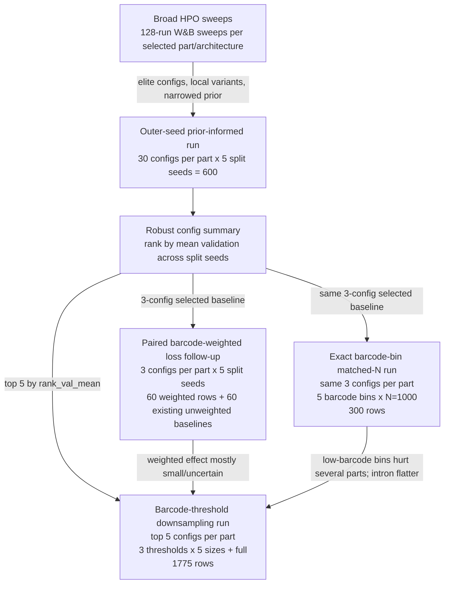

# Lib1 Sweep Workflow Relationships

Generated: 2026-06-17

Purpose: diagram-ready handoff note describing how the Lib1 in-house scratch
sweeps relate to each other, which configs/runs were promoted downstream, and
why each follow-up changed the sweep design.

## One-Line Workflow

```text
Broad HPO sweeps
  -> outer-seed prior-informed manifest
  -> selected robust config follow-ups:
       paired barcode-weighted loss
       exact barcode-bin matched-N
       barcode-threshold downsampling learning curves
```

The follow-up experiments do not form a strict single chain where each one
selects the next. Instead, the outer-seed run is the main config-selection
anchor. The weighted-loss and exact-bin runs used an earlier 3-config shortlist
from that anchor. The threshold-downsampling run returned to the same
outer-seed config summary and expanded the shortlist to 5 configs per part.

## Diagram Sketch



## Stage 1: Broad HPO Sweeps

Broad HPO was the discovery stage. It searched wider hyperparameter spaces and
helped choose a promising architecture per part.

| Part | Architecture promoted to outer-seed run | Broad HPO W&B sweep ID used as prior | Broad HPO W&B project |
|---|---|---|---|
| Promoter | `PromoterBassetVL` | `vi17zxcm` | `promoter__bashor_in_house__lib1_allvalid__scratch__promoter_bassetvl` |
| Intron | `ResNet1DRegressor` | `5b0njbjz` | `introns__bashor_in_house__lib1_intron_modal80__scratch__resnet1d` |
| 3 Prime UTR | `ResNet1DRegressor` | `bnyvegba` | `utr3__bashor_in_house__threeprime_modal100__scratch__resnet1d_fp32` |
| 5 Prime UTR | `ResNet1DRegressor` | `87uud4bc` | `utr5__bashor_in_house__fiveprime_modal50__scratch__resnet1d_fp32` |

Why move beyond broad HPO:

- Broad HPO was good for finding useful hyperparameter regions.
- It mixed stochastic factors such as split seed, sometimes model seed, and
  reverse-complement policy into the search.
- It did not reliably evaluate the same non-seed config across multiple
  heldout splits.
- Therefore, a high validation score could reflect a genuinely good config, an
  easier heldout split, or both.

## Stage 2: Outer-Seed Prior-Informed Run

Manifest tag:

```text
lib1_outer_seed_prior_no_rc_june2026
```

Design:

```text
4 parts
x 30 base configs per part
x 5 split seeds [101, 202, 303, 404, 505]
= 600 runs
```

Fixed settings:

```text
model_seed = 1701
use_reverse_complements = false
heldout policy = high-barcode val/test
```

Base configs per part:

```text
cfg001-cfg008   exact_elite from broad HPO
cfg009-cfg020   local_variant jittered around elite configs
cfg021-cfg030   narrow_prior sampled from narrowed broad-HPO prior space
```

Important naming point:

- `promoter_cfg011`, `intron_cfg009`, `utr3_cfg022`, etc. are config IDs
  created by the outer-seed manifest generator.
- They are not W&B run IDs.
- When `config_source` is `exact_elite`, the config is an observed broad-HPO
  config.
- When `config_source` is `local_variant`, the config is a generated local
  variant around an observed broad-HPO elite; the manifest still records the
  broad-HPO source run that seeded it.
- When `config_source` is `narrow_prior`, the config was sampled from the
  narrowed prior and does not have a single source run ID.

Why transition to this design:

- The scientific question changed from "what hyperparameters might work?" to
  "which configs are robust across heldout splits?"
- `split_seed` became an outer loop, not an ordinary W&B HPO parameter.
- A fixed manifest ensured paired evaluation: each config was run on the same
  five split seeds.
- A global GPU queue kept hardware busy while preserving exact manifest rows.

Selection output:

```text
src/learn/outputs/hpo_analyses/lib1_outer_seed_prior_no_rc_june2026/
  outer_seed_config_summary.csv
```

Configs were ranked primarily by:

```text
rank_val_mean
```

Test metrics were retained as diagnostics, not used for promotion.

## Outer-Seed Exact Elites From Broad HPO

These are the observed broad-HPO runs that became `cfg001` through `cfg008` in
the outer-seed base-config table. Local variants can also point back to these
or other elite source runs.

| Part | Outer config | Broad HPO source run | Prior sweep ID | Source split seed | Source model seed | Source val Pearson |
|---|---|---|---|---:|---:|---:|
| Promoter | `promoter_cfg001` | `cqg85h6j` | `vi17zxcm` | 101 |  | 0.425197 |
| Promoter | `promoter_cfg002` | `8d11bo4a` | `vi17zxcm` | 101 |  | 0.425044 |
| Promoter | `promoter_cfg003` | `hqguhv72` | `vi17zxcm` | 101 |  | 0.422907 |
| Promoter | `promoter_cfg004` | `3g6d37ru` | `vi17zxcm` | 101 |  | 0.418551 |
| Promoter | `promoter_cfg005` | `670guc9s` | `vi17zxcm` | 101 |  | 0.418008 |
| Promoter | `promoter_cfg006` | `vq3w7m6d` | `vi17zxcm` | 101 |  | 0.417722 |
| Promoter | `promoter_cfg007` | `wjij9r5k` | `vi17zxcm` | 101 |  | 0.417434 |
| Promoter | `promoter_cfg008` | `fq0dsrbp` | `vi17zxcm` | 101 |  | 0.416538 |
| Intron | `intron_cfg001` | `glgcweci` | `5b0njbjz` | 101 |  | 0.613275 |
| Intron | `intron_cfg002` | `n1lgjs2h` | `5b0njbjz` | 101 |  | 0.612131 |
| Intron | `intron_cfg003` | `1n5dz946` | `5b0njbjz` | 101 |  | 0.610699 |
| Intron | `intron_cfg004` | `8zdhzktp` | `5b0njbjz` | 101 |  | 0.607235 |
| Intron | `intron_cfg005` | `fqxbh33w` | `5b0njbjz` | 101 |  | 0.606491 |
| Intron | `intron_cfg006` | `7cjggitw` | `5b0njbjz` | 101 |  | 0.603273 |
| Intron | `intron_cfg007` | `0atcctzo` | `5b0njbjz` | 101 |  | 0.596291 |
| Intron | `intron_cfg008` | `v4swhcj1` | `5b0njbjz` | 101 |  | 0.593105 |
| 3 Prime UTR | `utr3_cfg001` | `8xcp9her` | `bnyvegba` | 101 |  | 0.455851 |
| 3 Prime UTR | `utr3_cfg002` | `csba9la4` | `bnyvegba` | 404 |  | 0.427890 |
| 3 Prime UTR | `utr3_cfg003` | `wep13ohn` | `bnyvegba` | 303 |  | 0.359374 |
| 3 Prime UTR | `utr3_cfg004` | `4ttjrq7l` | `bnyvegba` | 202 |  | 0.312877 |
| 3 Prime UTR | `utr3_cfg005` | `np7huddo` | `bnyvegba` | 404 |  | 0.373167 |
| 3 Prime UTR | `utr3_cfg006` | `ld1j3s9n` | `bnyvegba` | 303 |  | 0.358064 |
| 3 Prime UTR | `utr3_cfg007` | `yzbd47ze` | `bnyvegba` | 404 |  | 0.372783 |
| 3 Prime UTR | `utr3_cfg008` | `8576dgbl` | `bnyvegba` | 303 |  | 0.357758 |
| 5 Prime UTR | `utr5_cfg001` | `4a2z7obx` | `87uud4bc` | 101 | 1702 | 0.540936 |
| 5 Prime UTR | `utr5_cfg002` | `sj1fzyge` | `87uud4bc` | 303 | 1702 | 0.515443 |
| 5 Prime UTR | `utr5_cfg003` | `ryofque1` | `87uud4bc` | 202 | 1701 | 0.486375 |
| 5 Prime UTR | `utr5_cfg004` | `fgjgoudq` | `87uud4bc` | 303 | 1702 | 0.501280 |
| 5 Prime UTR | `utr5_cfg005` | `gwctkv4g` | `87uud4bc` | 202 | 1702 | 0.482493 |
| 5 Prime UTR | `utr5_cfg006` | `9vrbvjr1` | `87uud4bc` | 303 | 1701 | 0.500466 |
| 5 Prime UTR | `utr5_cfg007` | `kx7urkn3` | `87uud4bc` | 303 | 1702 | 0.498758 |
| 5 Prime UTR | `utr5_cfg008` | `tuwcda3w` | `87uud4bc` | 202 | 1702 | 0.479825 |

## Stage 3: Paired Barcode-Weighted Loss Follow-Up

Manifest tag:

```text
lib1_outer_seed_selected_barcode_weighted_june2026
```

Design:

```text
4 parts
x 3 selected configs per part
x 5 split seeds
= 60 weighted rows
```

The paired unweighted baseline was not rerun by default. It was taken from the
existing outer-seed run:

```text
60 weighted rows + 60 existing unweighted baseline rows
```

Changed variable:

```text
graph_module = CNNWeightedRegressionTraining
barcode_weighting = true
barcode_weight_cap = 8.0
barcode_weight_min = 0.1
```

Everything else important was held paired:

```text
same config_id
same split_seed
same model_seed = 1701
same high-barcode heldout split
same no-RC policy
```

Why transition to this design:

- Outer-seed residual diagnostics suggested low-barcode rows may have noisier
  labels.
- Weighted loss tests whether downweighting low-barcode training examples
  improves high-barcode heldout generalization.
- The paired design isolates the training-loss change from config, split, and
  heldout differences.

Result context used later:

- Weighted loss looked small/mostly neutral overall.
- Some parts had mild gains, but confidence was not strong enough to mix
  weighted loss into the next barcode-threshold learning-curve run.
- Therefore, later barcode-threshold downsampling intentionally returned to
  unweighted `CNNBasicTraining`.

Promoted configs for weighted-loss follow-up:

| Part | Selected configs | Source note |
|---|---|---|
| Promoter | `promoter_cfg011`, `promoter_cfg029`, `promoter_cfg018` | outer-seed selected robust configs |
| Intron | `intron_cfg011`, `intron_cfg013`, `intron_cfg009` | outer-seed selected robust configs |
| 3 Prime UTR | `utr3_cfg001`, `utr3_cfg009`, `utr3_cfg022` | outer-seed selected robust configs |
| 5 Prime UTR | `utr5_cfg007`, `utr5_cfg015`, `utr5_cfg001` | outer-seed selected robust configs |

Detailed provenance:

| Part | Config | Outer-seed rank by val mean | Config source | Broad HPO source run | Prior sweep ID |
|---|---|---:|---|---|---|
| Promoter | `promoter_cfg011` | 1 | `local_variant` | `hqguhv72` | `vi17zxcm` |
| Promoter | `promoter_cfg029` | 2 | `narrow_prior` |  | `vi17zxcm` |
| Promoter | `promoter_cfg018` | 4 | `local_variant` | `8d11bo4a` | `vi17zxcm` |
| Intron | `intron_cfg011` | 1 | `local_variant` | `1n5dz946` | `5b0njbjz` |
| Intron | `intron_cfg013` | 2 | `local_variant` | `fqxbh33w` | `5b0njbjz` |
| Intron | `intron_cfg009` | 3 | `local_variant` | `glgcweci` | `5b0njbjz` |
| 3 Prime UTR | `utr3_cfg001` | 1 | `exact_elite` | `8xcp9her` | `bnyvegba` |
| 3 Prime UTR | `utr3_cfg009` | 2 | `local_variant` | `8xcp9her` | `bnyvegba` |
| 3 Prime UTR | `utr3_cfg022` | 4 | `narrow_prior` |  | `bnyvegba` |
| 5 Prime UTR | `utr5_cfg007` | 1 | `exact_elite` | `kx7urkn3` | `87uud4bc` |
| 5 Prime UTR | `utr5_cfg015` | 3 | `local_variant` | `kx7urkn3` | `87uud4bc` |
| 5 Prime UTR | `utr5_cfg001` | 7 | `exact_elite` | `4a2z7obx` | `87uud4bc` |

## Stage 4: Exact Barcode-Bin Matched-N Run

Manifest tag:

```text
lib1_barcode_bin_matched_n1000_june2026
```

Design:

```text
4 parts
x same 3 selected configs per part as weighted-loss follow-up
x 5 split seeds
x 5 exact barcode bins
= 300 rows
```

Barcode bins:

```text
n=1
n=2
n=3
n=4-5
n>=6
```

Training size:

```text
train_size_n = 1000
train_sampling_mode = random
loss = unweighted CNNBasicTraining
heldout = high-barcode val/test
```

Why transition to this design:

- Weighted loss asked whether low-barcode rows should receive smaller loss
  weight.
- The exact-bin run asked a sharper data-quality question: if training uses
  exactly one barcode-count range at matched N, how well does signal transfer
  to the high-barcode heldout set?
- Matching N=1000 prevented the high-barcode bins from winning just because
  they supplied more training examples.

Main read that motivated the next step:

- Promoter, 3 Prime UTR, and 5 Prime UTR showed worse generalization as barcode
  count decreased.
- Intron looked comparatively flat across barcode bins.
- This suggested a practical threshold policy question: should low-barcode rows
  be filtered, and does that depend on training-set size?

Promoted configs for barcode-bin run:

The exact-bin run reused the same selected config set as the weighted-loss
follow-up:

| Part | Selected configs |
|---|---|
| Promoter | `promoter_cfg011`, `promoter_cfg029`, `promoter_cfg018` |
| Intron | `intron_cfg011`, `intron_cfg013`, `intron_cfg009` |
| 3 Prime UTR | `utr3_cfg001`, `utr3_cfg009`, `utr3_cfg022` |
| 5 Prime UTR | `utr5_cfg007`, `utr5_cfg015`, `utr5_cfg001` |

## Stage 5: Barcode-Threshold Downsampling Learning Curves

Manifest tag:

```text
lib1_barcode_threshold_downsample_june2026
```

Design:

```text
4 parts
x 5 selected configs per part
x 5 split seeds
x 3 barcode thresholds
x 6 size arms
= 1800 possible rows
- 25 infeasible 3 Prime UTR bc_ge3 n3500 rows
= 1775 actual rows
```

Barcode threshold policies:

```text
bc_ge1 = train_min_barcodes >= 1
bc_ge2 = train_min_barcodes >= 2
bc_ge3 = train_min_barcodes >= 3
```

Training size arms:

```text
N = 100, 500, 1500, 2500, 3500, full
```

Special feasibility caveat:

```text
3 Prime UTR with bc_ge3 has only 3484 eligible training rows after heldout
removal, so exact N=3500 is skipped for all 25 config x split-seed cells.
```

Why transition to this design:

- The exact-bin run answered "what happens if training uses only one barcode
  range at fixed N=1000?"
- The threshold run answers the operational question:

```text
At matched training sizes, should full training use 1+, 2+, or 3+ barcode rows?
How quickly does each threshold policy saturate as N grows?
```

- This is closer to future training policy because real training pools are
  thresholded mixtures, not exact barcode bins.
- The run keeps unweighted loss so the comparison is not confounded by the
  weighted-loss intervention.
- It expands from 3 to 5 configs per part because threshold effects may
  interact with hyperparameters, and the exact-bin run showed some noisy
  config-level behavior.

Promoted configs for threshold-downsampling run:

These were selected directly from the outer-seed config summary using
`rank_val_mean`, not from the weighted-loss or barcode-bin results.

| Part | Selected configs |
|---|---|
| Promoter | `promoter_cfg011`, `promoter_cfg029`, `promoter_cfg014`, `promoter_cfg018`, `promoter_cfg013` |
| Intron | `intron_cfg011`, `intron_cfg013`, `intron_cfg009`, `intron_cfg014`, `intron_cfg003` |
| 3 Prime UTR | `utr3_cfg001`, `utr3_cfg009`, `utr3_cfg003`, `utr3_cfg022`, `utr3_cfg011` |
| 5 Prime UTR | `utr5_cfg007`, `utr5_cfg005`, `utr5_cfg015`, `utr5_cfg008`, `utr5_cfg019` |

Detailed provenance:

| Part | Config | Outer-seed rank by val mean | Config source | Broad HPO source run | Prior sweep ID |
|---|---|---:|---|---|---|
| Promoter | `promoter_cfg011` | 1 | `local_variant` | `hqguhv72` | `vi17zxcm` |
| Promoter | `promoter_cfg029` | 2 | `narrow_prior` |  | `vi17zxcm` |
| Promoter | `promoter_cfg014` | 3 | `local_variant` | `vq3w7m6d` | `vi17zxcm` |
| Promoter | `promoter_cfg018` | 4 | `local_variant` | `8d11bo4a` | `vi17zxcm` |
| Promoter | `promoter_cfg013` | 5 | `local_variant` | `670guc9s` | `vi17zxcm` |
| Intron | `intron_cfg011` | 1 | `local_variant` | `1n5dz946` | `5b0njbjz` |
| Intron | `intron_cfg013` | 2 | `local_variant` | `fqxbh33w` | `5b0njbjz` |
| Intron | `intron_cfg009` | 3 | `local_variant` | `glgcweci` | `5b0njbjz` |
| Intron | `intron_cfg014` | 4 | `local_variant` | `7cjggitw` | `5b0njbjz` |
| Intron | `intron_cfg003` | 5 | `exact_elite` | `1n5dz946` | `5b0njbjz` |
| 3 Prime UTR | `utr3_cfg001` | 1 | `exact_elite` | `8xcp9her` | `bnyvegba` |
| 3 Prime UTR | `utr3_cfg009` | 2 | `local_variant` | `8xcp9her` | `bnyvegba` |
| 3 Prime UTR | `utr3_cfg003` | 3 | `exact_elite` | `wep13ohn` | `bnyvegba` |
| 3 Prime UTR | `utr3_cfg022` | 4 | `narrow_prior` |  | `bnyvegba` |
| 3 Prime UTR | `utr3_cfg011` | 5 | `local_variant` | `wep13ohn` | `bnyvegba` |
| 5 Prime UTR | `utr5_cfg007` | 1 | `exact_elite` | `kx7urkn3` | `87uud4bc` |
| 5 Prime UTR | `utr5_cfg005` | 2 | `exact_elite` | `gwctkv4g` | `87uud4bc` |
| 5 Prime UTR | `utr5_cfg015` | 3 | `local_variant` | `kx7urkn3` | `87uud4bc` |
| 5 Prime UTR | `utr5_cfg008` | 4 | `exact_elite` | `tuwcda3w` | `87uud4bc` |
| 5 Prime UTR | `utr5_cfg019` | 5 | `local_variant` | `ryofque1` | `87uud4bc` |

## Experiment Relationship Summary

| Stage | Tag or source | Main question | Promotion source | Output used downstream |
|---|---|---|---|---|
| Broad HPO | W&B sweep IDs `vi17zxcm`, `5b0njbjz`, `bnyvegba`, `87uud4bc` | Which architecture/hyperparameter regions are promising? | Raw W&B broad HPO validation runs | Narrowed priors and exact elite seeds for outer-seed run |
| Outer-seed prior-informed run | `lib1_outer_seed_prior_no_rc_june2026` | Which configs are robust across heldout splits? | Broad HPO exact elites, local variants, and narrow-prior samples | `outer_seed_config_summary.csv` ranked by validation mean |
| Weighted loss | `lib1_outer_seed_selected_barcode_weighted_june2026` | Does barcode-weighted training improve high-barcode heldout generalization? | 3 selected outer-seed configs per part | Result: weighted loss mostly small/uncertain; do not mix into threshold run |
| Exact barcode-bin matched-N | `lib1_barcode_bin_matched_n1000_june2026` | How does training on exact barcode-count bins transfer to high-barcode heldout? | Same 3 selected outer-seed configs per part | Result: low-barcode bins hurt several parts; motivates threshold policy |
| Barcode-threshold downsampling | `lib1_barcode_threshold_downsample_june2026` | Which minimum barcode threshold works best at matched training sizes? | Top 5 outer-seed configs per part by `rank_val_mean` | Current learning-curve experiment |

## Key Design Transitions And Rationale

1. Broad HPO -> outer-seed manifest

   Reason: broad HPO discovered useful regions, but config quality was
   confounded with split difficulty. The outer-seed manifest repeats each
   config across the same split seeds to measure robustness.

2. Outer-seed manifest -> weighted-loss paired follow-up

   Reason: residual diagnostics suggested low-barcode training rows may be
   noisier. A paired design tests weighted loss while holding config, split,
   model seed, and heldout policy fixed.

3. Outer-seed manifest -> exact barcode-bin matched-N

   Reason: weighted loss asks about loss weighting; barcode-bin asks a more
   direct data-quality question. Matching N=1000 isolates barcode-count range
   from training-set size.

4. Exact barcode-bin results -> threshold downsampling

   Reason: exact bins are diagnostic, but real training policy uses thresholded
   mixtures. The downsampling run asks whether `1+`, `2+`, or `3+` gives the
   best heldout performance at matched N and how learning curves saturate.

5. Weighted-loss result -> keep threshold downsampling unweighted

   Reason: weighted-loss effects were small and uncertain. Mixing weighted
   loss into the threshold run would confound the barcode-threshold and
   sample-size questions.

6. 3-config shortlist -> 5-config shortlist for downsampling

   Reason: exact-bin results were useful but sometimes noisy. The threshold
   effect could interact with hyperparameters, so top 5 gives better
   config-level uncertainty while avoiding a fresh HPO.

## Suggested Illustration Labels

Use these short labels in a figure:

- "Broad HPO: discovery"
- "Outer-seed run: robustness selection"
- "Weighted loss: paired loss-function ablation"
- "Exact barcode bins: data-quality diagnostic"
- "Threshold downsampling: operational learning curves"

Use these visual encodings:

- Solid arrows for config promotion.
- Dashed arrows for result-motivated design changes.
- Color code `exact_elite`, `local_variant`, and `narrow_prior`.
- Put `split_seed` as an outer loop badge on all downstream manifests.
- Put `model_seed=1701`, `RC off`, and "high-barcode heldout" as shared
  constants for outer-seed and follow-up runs.

## Source Artifacts

Primary local artifacts:

```text
src/learn/outputs/hpo_manifests/lib1_outer_seed_prior_no_rc_june2026__base_configs.csv
src/learn/outputs/hpo_manifests/lib1_outer_seed_prior_no_rc_june2026__run_manifest.csv
src/learn/outputs/hpo_analyses/lib1_outer_seed_prior_no_rc_june2026/outer_seed_config_summary.csv
src/learn/outputs/hpo_manifests/lib1_outer_seed_selected_barcode_weighted_june2026__summary.json
src/learn/outputs/hpo_manifests/lib1_barcode_bin_matched_n1000_june2026__summary.json
src/learn/outputs/hpo_manifests/lib1_barcode_threshold_downsample_june2026__summary.json
```

Generator scripts:

```text
src/learn/generate_lib1_outer_seed_prior_hpo_manifest.py
src/learn/generate_lib1_weighted_loss_followup_manifest.py
src/learn/generate_lib1_barcode_bin_matched_manifest.py
src/learn/generate_lib1_barcode_threshold_downsampling_manifest.py
```

